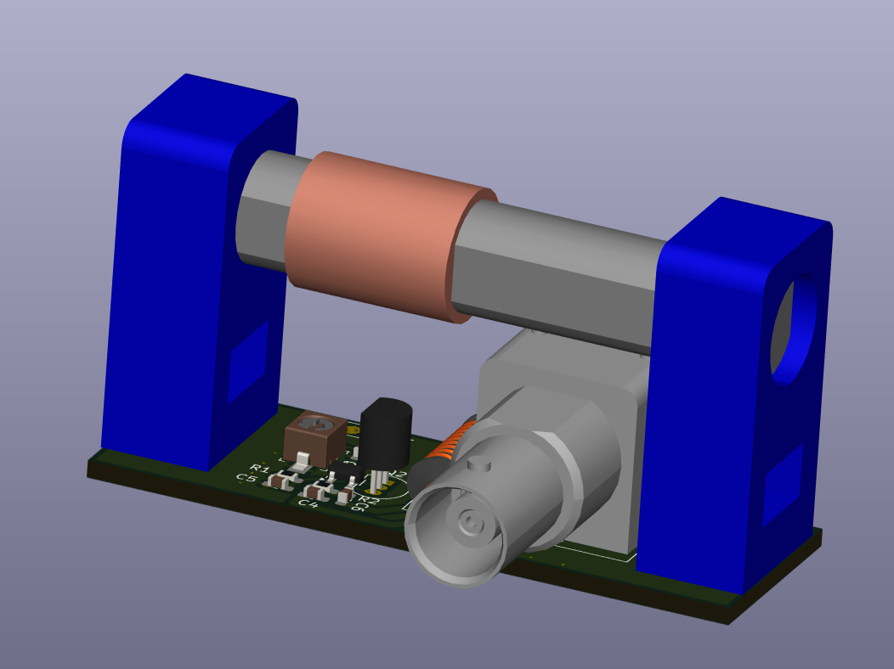

# PCSK225-Antenna

This simple active antenna is designed to receive the time signal from the PCSK-225 transmitter in Solec Kujawski, Poland.

It allows you to reliably receive UTC(pl) time frames transmitted by the <a href="https://e-czas.gum.gov.pl/e-czas-radio/" target=_blank>Central Office of Measures</a> using this transmitter. Receiver documentation is available at https://github.com/e-czasPL/TimeReceiver225kHz.

The project uses a ferrite antenna from a cheap and popular DCF receiver available, for example, on Aliexpress. Such an antenna has an inductance of approximately 1.5mH. You need to use 333pF capacitors (270pF + 56pF + trimmer 6-25pF) which will allow you to tune the resonant circuit to 225kHz.

The transistor BF545 or MMBFJ108 (SMD) or BF245 (THT) was used as an amplifier - only one should be installed.

If a long-wave ferrite antenna (from an old radio) with an inductance of about 4-6mH is used, the capacitors should be reduced to about 100pF.

<ul>
<li>In the /KiCAD folder, you will find a project in the KiCAD 8.0 format;
<li>In the /3D folder, you will find models of the holder and the entire antenna in STEP, STL formats;
</ul>

The long wave signal of the First Polish Radio Program reaches a large part of Europe. You can see the coverage map below.

<table border=0 cellpadding=0 cellspacing=0 width=100%>
<tr><td>
</td><td></td></tr>
</table>

Ta prosta aktywna antena jest zaprojektowana do odbioru sygnału czasu z nadajnika PCSK-225 w Solec Kujawski, Polska.

Pozwala ona niezawodnie odbierać ramki czasu UTC(pl) nadawane przez <a href="https://e-czas.gum.gov.pl/e-czas-radio/" target=_blank>Główny Urząd Miar</a> za pomocą tego nadajnika. Dokumentacja odbiornika jest dostępna na https://github.com/e-CzasPL/TimeReceiver225kHz.

W projekcie uzyto anteny ferrytowej od taniego i popularnego odbiornika DCF dostępnego np. na Aliexpress. Taka antena ma indukcyjność ok 1.5mH. Dla tego trzeba użyć kondensatorów 333pF (270pF + 56pF + trymer 6-25pF) co pozwoli zestroic obwód rezonansowy na 225kHz.

Jako wzmacniacz użyto tranzystora BF545 lub MMBFJ108 (SMD) lub BF245 (THT) - należy zamontowac tylko jeden z nich.

Jeżeli zostanie użyta antena ferrytowa na fale długie (ze starego radia) o indukcyjności ok 4-6mH to należy kondensatory zmniejszyć do ok 100pF.

<ul>
<li>W folderze /KiCAD znajdziesz projekt w formacie KiCAD 8.0;
<li>W folderze /3D znajdziesz modele uchwytu i całej anteny w formatach STEP, STL;
</ul>

Sygnał fal długich Programu Pierwszego Polskiego Radia dociera do dużej części Europy. Powyżej możesz zobaczyć mapę zasięgu.

Jerzy K. Kowalski Marek Mańkowski

