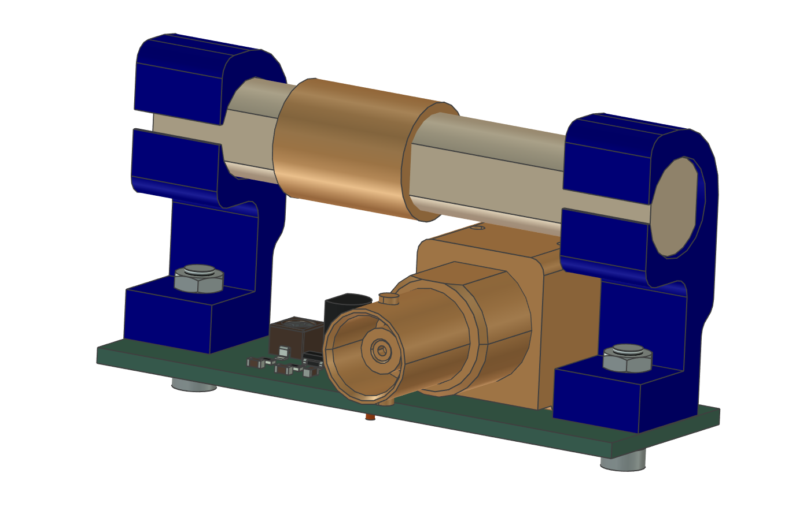

# PCSK225-Antenna

Ta prosta aktywna antena jest zaprojektowana do odbioru sygnału z nadajnika PCSK-225 w Solec Kujawski, Polska.

Pozwala ona niezawodnie odbierać ramki czasu UTC(pl) nadawane przez Główny Urząd Miar za pomocą tego nadajnika. Dokumentacja odbiornika jest dostępna na https://github.com/e-CzasPL/TimeReceiver225kHz.

Jerzy K. Kowalski Marek Mańkowski

